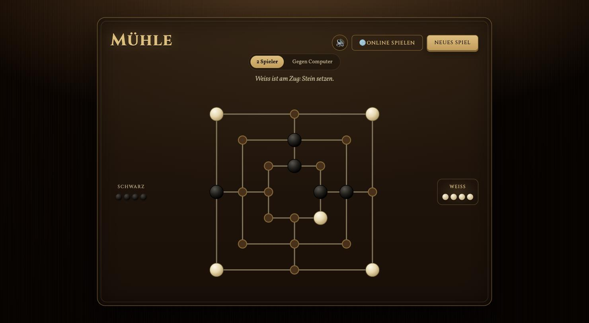

# Mühle

Nine Men's Morris, played in the browser. Flask serves the page and a small JSON API; the board is inline SVG driven by vanilla JS. No build step, no frontend framework.



## Features

- **2 Spieler** — local hotseat, one browser, both colors.
- **Gegen Computer** — a minimax (alpha-beta) AI opponent; choose to play White or Black.
- **Online** — invite a friend over the network via a shareable link (`/g/<game_id>?t=<token>`), sent by email or copied manually. Moves sync between browsers automatically.
- Full rule set: placing phase, sliding/moving phase, flying phase (3 stones left), mill formation and capture (with the mill-protection rule), stalemate detection.
- Synthesized sound effects (Web Audio API, no audio files) and mill-flash animations.

## Running it

Requires [`uv`](https://docs.astral.sh/uv/).

```bash
uv run python app.py
```

Then open `http://localhost:5001/`. The server also prints a LAN URL on startup for playing with someone else on the same network.

## Notes

- Network game state is kept in memory and is lost on server restart.
- For someone outside your network to join an online game, you'd need port-forwarding or a tunnel — the server only binds locally/on your LAN by default.
- The dev server runs with `debug=False` intentionally: Werkzeug's interactive debugger is a remote-code-execution risk once the server is reachable from other machines, which network play requires.
